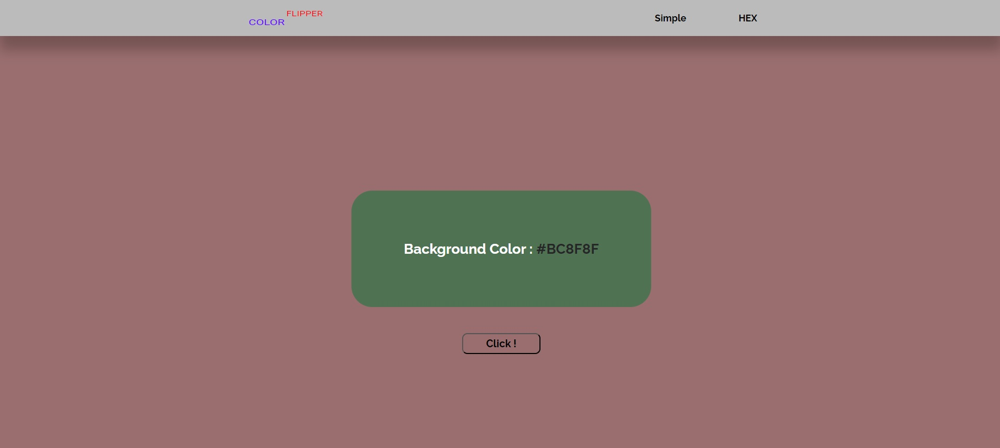

<h1 align="center">Color Flipper</h1>

---

## Description

Change background of web-page by clicking on te button. It has two modes: Simple and HEX.
Simple use 4 different colors and it change randomly.
Hex mode changes all HEX colors in random order.

